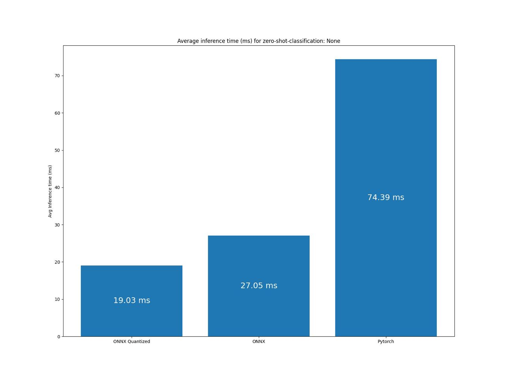
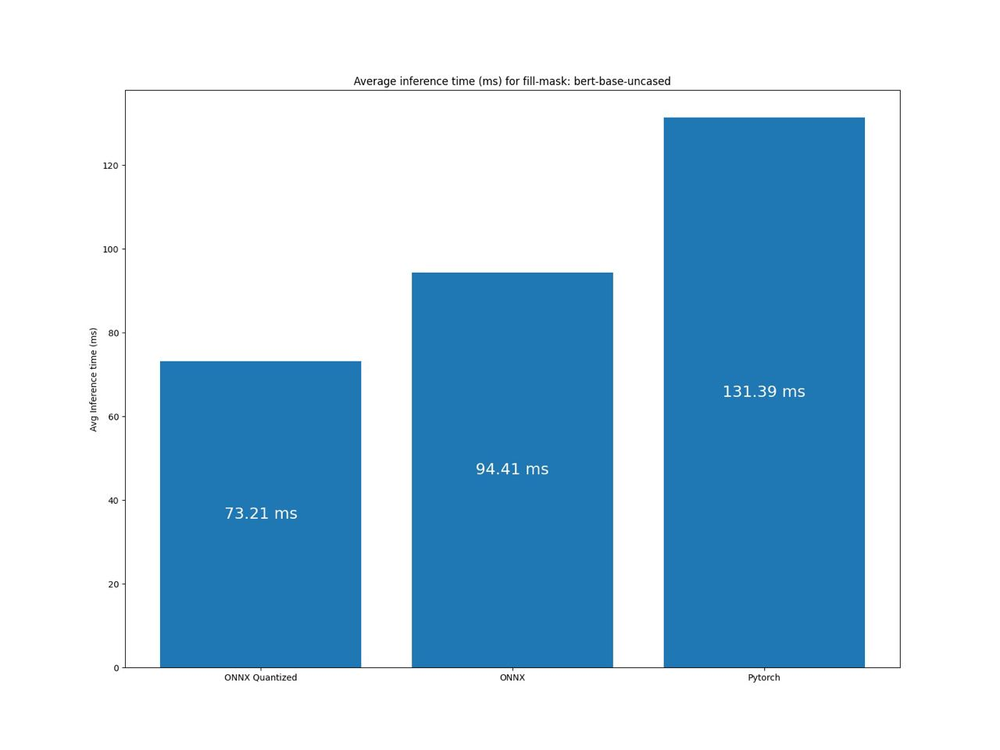

# Optimum Transformers


Accelerated NLP pipelines for fast inference 🚀 on CPU and GPU. Built with 🤗Transformers, Optimum and ONNX runtime.

> One of the aims of this project is to show myself to get into [Hugging Face](https://huggingface.co) team 🤗

## Installation:

```bash
pip install git+https://github.com/AlekseyKorshuk/optimum-transformers
```

## Usage:

The pipeline API is similar to transformers [pipeline](https://huggingface.co/transformers/main_classes/pipelines.html)
with just a few differences which are explained below.

Just provide the path/url to the model, and it'll download the model if needed from
the [hub](https://huggingface.co/models) and automatically create onnx graph and run inference.

```python
from optimum_transformers import pipeline

# Initialize a pipeline by passing the task name and 
# set onnx to True (default value is also True)
>> > nlp = pipeline("sentiment-analysis", use_onnx=True)
>> > nlp("Transformers and onnx runtime is an awesome combo!")
[{'label': 'POSITIVE', 'score': 0.999721109867096}]  
```

Or provide a different model using the `model` argument.

```python
from optimum_transformers import pipeline

>> > nlp = pipeline("question-answering", model="deepset/roberta-base-squad2", use_onnx=True)
>> > nlp(question="What is ONNX Runtime ?",
         context="ONNX Runtime is a highly performant single inference engine for multiple platforms and hardware")
{'answer': 'highly performant single inference engine for multiple platforms and hardware', 'end': 94,
 'score': 0.751201868057251, 'start': 18}
```

```python
from optimum_transformers import pipeline

>> > nlp = pipeline("ner", model="mys/electra-base-turkish-cased-ner", use_onnx=True, optimize=True,
                    grouped_entities=True)
>> > nlp("adana kebap ülkemizin önemli lezzetlerinden biridir.")
[{'entity_group': 'B-food', 'score': 0.869149774312973, 'word': 'adana kebap'}]
```

Set `onnx` to `False` for standard torch inference. Set `optimize` to `True` for quantize with ONNX. ( set `use_onnx` to
True)

You can create `Pipeline` objects for the following down-stream tasks:

- `feature-extraction`: Generates a tensor representation for the input sequence
- `ner` and `token-classification`: Generates named entity mapping for each word in the input sequence.
- `sentiment-analysis`: Gives the polarity (positive / negative) of the whole input sequence. Can be used for any text
  classification model.
- `question-answering`: Provided some context and a question referring to the context, it will extract the answer to the
  question in the context.
- `text-classification`: Classifies sequences according to a given number of classes from training.
- `zero-shot-classification`: Classifies sequences according to a given number of classes directly in runtime.
- `fill-mask`: The task of masking tokens in a sequence with a masking token, and prompting the model to fill that mask
  with an appropriate token.

Calling the pipeline for the first time loads the model, creates the onnx graph, and caches it for future use. Due to
this, the first load will take some time. Subsequent calls to the same model will load the onnx graph automatically from
the cache.

## Benchmarks

> Note: For some reason, onnx is slow on colab notebook, so you won't notice any speed-up there. Benchmark it on your own hardware.

Check our example of benchmarking: [example](./examples/benchmark).

For detailed benchmarks and other information refer to this blog post and notebook.

- [Accelerate your NLP pipelines using Hugging Face Transformers and ONNX Runtime](https://medium.com/microsoftazure/accelerate-your-nlp-pipelines-using-hugging-face-transformers-and-onnx-runtime-2443578f4333)
- [Exporting 🤗 transformers model to ONNX](https://github.com/huggingface/transformers/blob/master/notebooks/04-onnx-export.ipynb)

> Note: These results were collected on my local machine. So if you have high performance machine to benchmark, please contact me.

**Benchmark `sentiment-analysis` pipeline**


**Benchmark `zero-shot-classification` pipeline**



**Benchmark `token-classification` pipeline**


**Benchmark `question-answering` pipeline**


**Benchmark `fill-mask` pipeline**



## About

*Built by Aleksey Korshuk*

[](https://github.com/AlekseyKorshuk)

[](https://twitter.com/intent/follow?screen_name=alekseykorshuk)

[](https://t.me/joinchat/_CQ04KjcJ-4yZTky)

🚀 If you want to contribute to this project OR create something cool together — contact
me: [link](https://github.com/AlekseyKorshuk)

Star this repository:

[](https://github.com/AlekseyKorshuk/optimum-transformers)

## Resources

* Inspired by [Huggingface Infinity](https://huggingface.co/infinity)
* First step done by [Suraj Patil](https://github.com/patil-suraj/onnx_transformers)
* [Optimum](https://huggingface.co/docs/optimum/index)
* [ONNX](https://onnx.ai)
